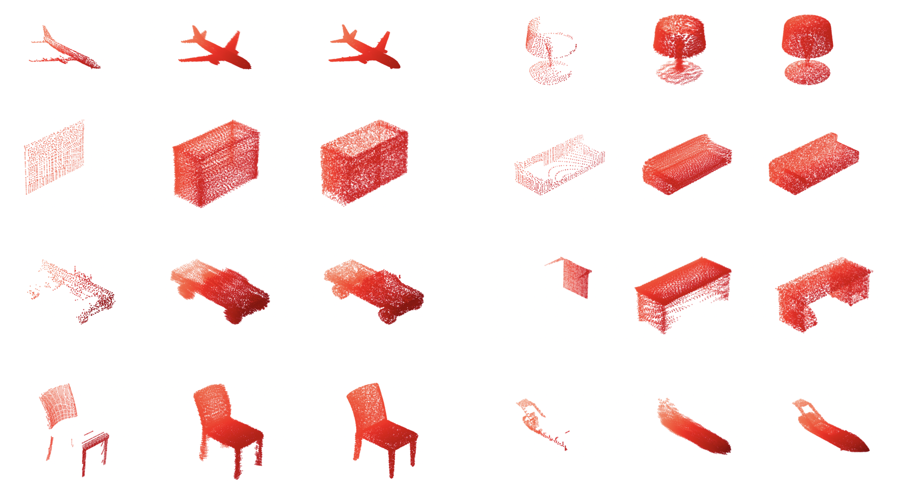
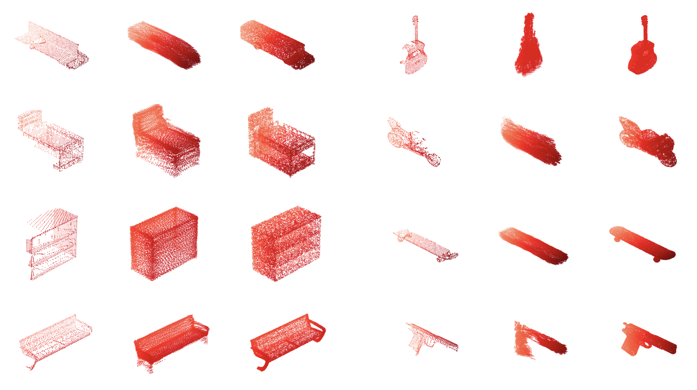

# PCN: Point Completion Network

## Introduction


This is implementation of PCN——Point Completion Network in pytorch. PCN is an autoencoder for point cloud completion. As for the details of the paper, please refer to [arXiv](https://arxiv.org/pdf/1808.00671.pdf).

## Environment

* Ubuntu 18.04 LTS
* Python 3.7.9
* PyTorch 1.7.0
* CUDA 10.1.243

## Prerequisite

Compile for cd and emd:

```shell
cd extensions/chamfer_distance
python setup.py install
cd ../earth_movers_distance
python setup.py install
```

**Hint**: Don't compile on Windows platform.

As for other modules, please install by:

```shell
pip install -r requirements.txt
```

## Dataset

Please reference `render` and `sample` to create your own dataset. Also, we decompressed all `.lmdb` data from [PCN](https://drive.google.com/drive/folders/1M_lJN14Ac1RtPtEQxNlCV9e8pom3U6Pa) data into `.ply` data which has smaller volume 8.1G and upload it into Google Drive. Here is the shared link: [Google Drive](https://drive.google.com/file/d/1OvvRyx02-C_DkzYiJ5stpin0mnXydHQ7/view?usp=sharing).

## Training

In order to train the model, please use script:

```shell
python train.py --exp_name PCN_16384 --lr 0.0001 --epochs 400 --batch_size 32 --coarse_loss cd --num_workers 8
```

If you want to use emd to calculate the distances between coarse point clouds, please use script:

```shell
python train.py --exp_name PCN_16384 --lr 0.0001 --epochs 400 --batch_size 32 --coarse_loss emd --num_workers 8
```

## Testing

In order to test the model, please use follow script:

```shell
python test.py --exp_name PCN_16384 --ckpt_path <path of pretrained model> --batch_size 32 --num_workers 8
```

Because of the computation cost for calculating emd for 16384 points, I split out the emd's evaluation. The parameter `--emd` is used for testing emd. The parameter `--novel` is for novel testing data contains unseen categories while training. The parameter `--save` is used for saving the prediction into `.ply` file and visualize the result into `.png` image.

## Pretrained Model

The pretrained model is in `checkpoint/`.

## Results

I trained the model on Nvidia GPU 1080Ti with L1 Chamfer Distance for 400 epochs with initial learning rate 0.0001 and decay by 0.7 every 50 epochs. The batch size is 32. Best model is the minimum l1 cd one in validation data.

### Quantitative Result

#### Seen Categories:

Category | L1_CD(1e-3) | L2_CD(1e-4) | EMD(1e-3) | FScore-0.01(%)
-- | -- | -- | -- | --
Airplane | 6.0028 | 1.7323 | 10.5922 | 86.2954
Cabinet | 11.2092 | 4.7351 | 27.1505 | 61.6697
Car | 9.1304 | 2.7157 | 14.3661 | 70.5874
Chair | 12.0340 | 5.8717 | 22.4904 | 58.2958
Lamp | 12.6754 | 7.5891 | 58.7799 | 57.8894
Sofa | 12.8218 | 6.4572 | 19.2891 | 53.4009
Table | 9.8840 | 4.5669 | 23.7691 | 70.9750
Vessel | 10.1603 | 4.2766 | 17.9761 | 66.6521
**Average** | 10.4897 | 4.7431 | 24.3017 | 65.7207

#### Unseen Categories

Category | L1_CD(1e-3) | L2_CD(1e-4) | EMD(1e-3) | F-score(th=0.01)(%)
-- | -- | -- | -- | --
Bus       | 10.5110 | 4.4648  | 17.0274 | 66.9774
Bed       | 24.9320 | 32.4809 | 42.7974 | 32.2265
Bookshelf | 15.8186 | 13.1783 | 28.5608 | 50.0337
Bench     | 12.1345 | 7.3033  | 12.7497 | 62.4376
Guitar    | 11.4964 | 5.9601  | 28.4223 | 59.4976
Motorbike | 15.3426 | 8.7723  | 21.8634 | 44.7431
Skateboard| 13.1909 | 7.9711  | 17.9910 | 58.4427
Pistol    | 17.4897 | 15.5062 | 33.8937 | 45.6073
**Average**  | 15.1145 | 11.9546 | 25.4132 | 52.4958

### Qualitative Result

#### Seen Categories



#### Unseen Categories



## Citation

* [PCN: Point Completion Network](https://arxiv.org/pdf/1808.00671.pdf)
* [PCN's official Tensorflow implementation](https://github.com/wentaoyuan/pcn)
